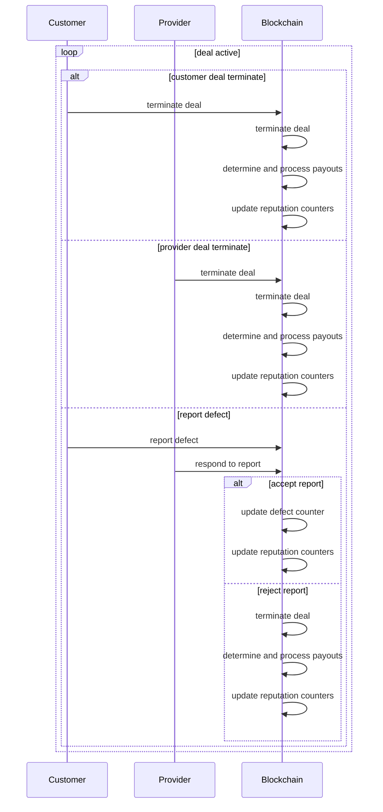
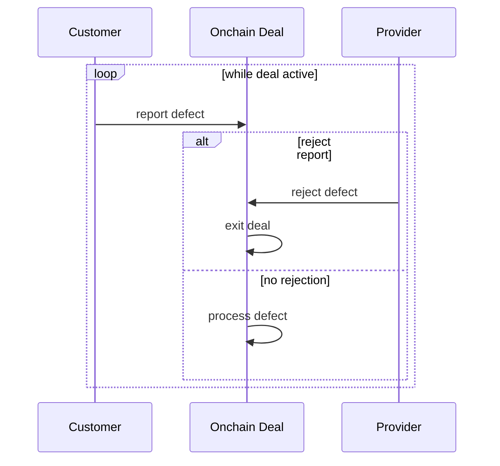

# Fluence dSLA Protocol

bb, 09/22/2024, WIP

## Introduction

Service Level Agreements (SLAs) are a cornerstone of cloud computing markets, serving as legally binding contracts that outline the delivery of computing resources based on predefined metrics. SLAs establish clear expectations between providers and customers, fostering a framework for accountability. A common feature of cloud service SLAs is that compensation for unmet SLA commitments is typically limited to the cost of the service during the affected period. For instance, if a cloud provider rents out a virtual machine (VM) for \$10 per month but fails to deliver the promised availability, the provider's maximum liability is limited to $10.

Customers often rely on monitoring tools and resolution processes provided, and even managed, by their cloud provider, with external intervention usually confined to arbitration. Thus, trust in the provider's brand, historical uptime performance, and the fair resolution of SLA breaches are crucial factors in defining the effectiveness of SLA agreements.

The Fluence decentralized compute platform represents a new paradigm in cloud(less) computing, facilitating the exchange of compute resources, such as Infrastructure as a Service (IaaS) and Platform as a Service (PaaS), in a trustless environment void of centralized control. Specifically, the Fluence protocol utilizes smart contracts to facilitate secure, automated transactions for provisioning and renting compute capacity from a network of Tier 4 data centers. This non-interactive approach ensures reliability and efficiency, allowing users to easily access high-quality computing resources.

Currently, the Fluence protocol lacks a quality of service framework for provisioned services, forcing customers to rely on latent attributes to select trustworthy and reliable providers. This approach is neither efficient nor desireable, especially considering the decentralized and diversity of compute providers. Therefore, implementing Service Level Agreements (SLAs) is essential as they not only improve compute customers' decision making but also allow providers to differentiate themselves in the marketplace.

Leaning on game theory and mechanism design, we propose a best-effort decentralized, trustless SLA framework resulting in a SLA protocol suitable for Fluence's trustless, non-interactive marketplace.

## SLA Fundamentals

We apply game theory to model SLAs to identify the prevailing strategic nature of service delivery and reporting. We further replay on mechanism design and incentive compatibility to create an environment most suitable to maintain a predictable set of strategies aligned with the core tenets of our desired system: providers are incentivized to adhere, or even exceed, their SLA commitments and both SLA providers and customers are incentivized to act honestly.

### The Basic SLA Structure

In a basic SLA framework, we have a service customer and a customer agreeing to some service contract governed by some quality of service (QoS). Each player has two strategies: act honestly, i.e., cooperate, or cheat, i.e., defect when it comes to the reporting and acceptance a reported defects. Due to the nature of the game, a player knows of the other player has cheated but neither player can provide a verifiable proof. Hence we are looking at an inspection game [] with the following (simplified) SLA game structure:

#### Players

* Customer ($C$)
* Service Provider ($SP$)

#### Actions

* Customer:
  * Report defect
  * Not report defect

* Provider:
  * Accept defect
  * Reject defect

#### Payoffs

* No Defect Reported, No Defect Exists:
  * $C$: -V
  * $SP$: V

* Defect Reported (by $CS), Defect Exists:
  * $C$: -V + $P_{SLA}$
  * $SP$: V - $P_{SLA}$

* Defect Reported (by $C$), No Defect Exists:
  * $C$: -V + $P_{SLA}$ (gain from falsely reporting)
  * $SP$: V - $P_{SLA}$ (still incurs defect penalty)

* No Defect Reported, Defect Exists:
  * $C$: -V (ignoring the cost of foregone service)
  * $SP$: V (ignoring the additional gain of not providing service)

where:

* $V$ is the value of the service contract, e.g., deal
* $P_{SLA}$ is the amount of the penalty incurred for SLA violations such that $P_{SLA} <= V$

##### Payoff Matrix

In this simplified SLA framework, if a provider meets the agreed-upon service levels, they earn a payoff *R*, e.g., \$10 per compute unit per month, and the customer pays $R$ resulting in a payoff tuple ($R$, $-R$) for the provider and customer, respectively. If the service falls short of expectations, an SLA penalty $P_{SLA}$ is subtracted from provider's revenue $R$ while the customer's payment is adjusted resulting in the new payoff tuple ($R-P_{SLA}$, $-R+P_{SLA}$).

Alas, in this naive setting both the provider and customer have incentives to cheat. While each player can detect cheating by the other, neither can provide objective proof. This dilemma is illustrated in Tables 1 and 2.

Table 1: Naive Payoff Matrix For SLA Game: Customer Cheats

| **Provider \ Customer** | **Truthful Reporting** | **False Reporting** |
|-------------------------|------------------------|---------------------|
| **High Availability**   | ($V$, $-V$)                | <font color="red">($V - P_{SLA}$, $-R + P_{SLA}$)</font> |
| **Low Availability**    | ($V - P_{SLA}$, $-V + P_{SLA}$)        | ($V -P_{SLA}$, $-V + P_{SLA}$)  (NA) |

Table 2: Naive Payoff Matrix For SLA Game: Provider Cheats

| **Customer \ Provider** | **Truthful Reporting** | **False Reporting** |
|-------------------------|------------------------|---------------------|
| **High Availability**   | ($V$, $-V$)                | ($V$, $-V$)  (NA)       |
| **Low Availability**    |  ($V - P_{SLA}$, $-V + P_{SLA}$)        |  <font color="red">($V - P_{SLA}$, $-V + P_{SLA}$)</font>                  |

Cheating is not objectively detectable in the (native) SLA game. For instance, a customer might ignore a ping request even when the VM is available or a provider could falsify availability records in a tamper-proof log for a VM that is actually unavailable. Consequently, only the participants are aware of the true state of the system, and there exists no definitively verifiable proof of the actual state.

SLAs are typically repeated games where reported defects, such as durations of unavailability, are aggregated over time and compared to threshold values to determine the applicability and magnitude of an SLA penalty $P_{SLA}$. As the game progresses, this can lead to endgame effects, where both the provider and the customer are increasingly incentivized to cheat to either avoid penalties or exploit (looming) defect thresholds.

Consequently, the (Nash) equilibrium often involves a mixed strategy that includes both cooperation and cheating and depends on the expectation of cheating and inspection frequency. While we ignored discount rates, gains/losses from cheating and the cumulative nature of defect aggregation against a specified threshold, these details have no material bearing on strategy selection and equilibrium.
Overall, the basic, naive SLA game framework that appears to work in interactive,centralized and trust-based systems to keep cheating in check appears unsuitable for decentralized, trustless environments like the Fluence DePIN compute marketplace. Hence, we need to transform the SLA game structure to be able to minimize, or entirely eliminate, cheating in a decentralized, trustless environment.

## SLA Protocol For Decentralized, Trustless Environments

Our main goal is to create and implement a SLA framework that drives incentive compatibility for both providers and customers, such that:

* Provider *SP* is incentivized to provide or exceed the Quality of Service (QoS) specified in the SLA
* Provider *SP* and customer *C* are incentivized to act truthfully at every step, aka repetition, of the game and especially at the end of the game, i.e., the end of the service contract


Since neither player can provide a verifiable proof that the other is cheating, a penalty framework needs to be introduced to credibly disincentivize dishonesty. Moreover, In a decentralized, trustless environment smart contracts play a critical role in manifesting and programmatically enforcing the rules of the game, which is a non-trivial departure from the centralized, trust-based model commonly offered in cloud service environments. While the existence of smart contracts does not magically resolve information asymmetry and cheating among parties, they certainly are helpful in transforming the game by providing (responsive) programmatic enforcement of rules, payments and penalties and allowing a fundamentally non-interactive framework.

In addition to a revised penalty framework, we also incorporate an exit condition available for both providers and customers currently available in the service contracts, aka deals, 

### Constructing The Penalty Model For Incentive Compatibility

Throughout the duration of a service contract governed by an SLA, both the provider and customer have multiple opportunities to exploit information asymmetries and engage in moral hazards. Therefore, it is essential to establish penalty models for each of these situations.

In addition to the potential for either the provider or customer to cheat regarding the reporting and acceptance of defects, both parties may exit a deal at any time before its due date without incurring penalties. This allows a provider to exit just before the cumulative defect count exceeds the penalty threshold, enabling them to retain (proportional) revenue before any SLA penalties apply.

We propose penalty models to address each scenario. Additionally, we suggest implementing reputation signals for the provider and customer that extend beyond the duration of a deal, serving as a persistent, global variable and an enduring indicator of past behavior.

#### Reporting Defection

The reporting defection scenario occurs when there is a disagreement between the provider and the customer regarding the level of service quality delivered. This conflict can arise from various factors, including deliberate dishonesty or insufficient monitoring of resources on either side. Regardless of the cause, this situation is undesirable and detrimental to the integrity and enforcement of the service contract and we propose an adjustment to the game that is programmatically enforceable by a (deal) smart contract, $SMD$.

##### Penalty Rule For Reported Defect Defection

At time $t$, $C$ reports a defect $d_t$ to $SMD$ and $SP$ either accepts or rejects the defect. If the provider accepts the defect, the cumulative defect counter $D_t$ increments by $d_t$ such that $D_t$ = $D_{t-1} + d_t$ and the game continues. If, on the other hand, $SP$ rejects $d_t$, the $SMD$ terminates the deal and imposes defection penalties on both the provider and the customer, without taking $d_t$ into consideration.

##### Actions And Payoffs

1. Deal Termination
    * The contract is terminated automatically by the $SMD$

2. No Defect Adjustment
    * The cumulative defect count remains unchanged, such that: 
\[D_t = D_{t-1} \]

3. Penalty Calculation
    * Provider revenue is 0
    * Customer cost is $max(t_e/t_d * V_d - P_{\text{SLA}}, 0)$

where:

* $V_d$ is the value, i.e., revenue to the provider and cost to the customer, of the deal for the agreed upon QoS 
* $P_{\text{SLA}} = 
\begin{cases} 
0 & \text{if } D_t \leq T \\
k \cdot (D_t - T) & \text{if } D_t > T \text{ , where k is the proportional multiplier} 
\end{cases}$

* $t_e \text{ is the time elapsed from start of deal } t - t_0$ and $t_d \text{ is the panned duration of the deal } t_{\text{end of deal}} - t_0$

##### Implications

The proposed penalty model is quite severe but falls short of requiring stakes and slashing, thereby making for a much more practical framework and implementation. Specifically, the model in conjunction with its programatic enforcement:

* Incentivizes Honest Reporting: By imposing penalties on both parties, it encourages transparency and accountability in defect reporting Keep in mind that both provider and customer have an expected value of engaging in a compute deal that at least equals but for all intends and purposes exceeds the deal value $V_d$. This is especially true for the provider as they are required to compensate their staker(s) from $V_d$. Hence, providers are unlikely to engage with customers deemed even ever so slightly dishonest. The same argument holds for customers. Some of the adverse effects from our draconian penalty model, such as a customer unwilling to report a defect if anticipating a cheating provider, are mitigated by providing an early exit option covered below.

* Ensures Fairness: The penalties are designed to mitigate the adverse effects of disputes, protecting both parties from undue losses.

* Promotes Efficient Resolution: The use of smart contracts allows for automatic enforcement of penalties, reducing the need for lengthy negotiations and facilitating quick resolutions.

#### Penalty Rule For Early Deal Termination

The decentralized, trustless Fluence marketplace inherently allow providers and customer to exit a deal any time prior to its expiration. In its unaltered state, this allows for gaming SLA agreements. For example, a provider might exit the deal when the defect count $D_t$ approaches the SLA penalty threshold $T$ in order to maximize revenue while failing to deliver the agreed upon QoS. Hence, we need a penalty model covering early deal termination.

##### Actions And Payoffs

1. Deal Termination By Customer

* The deal is terminated by the customer before the end of the service agreement and customer cost is the proportional value of the deal, $V_D$ minus any SLA penlaty credits, if applicable such that:
\[ \text{Customer cost is } \max(-(t_e/t_d*V_d) + P_SLA, 0) \]

2. Deal Termination By Provider

The deal is terminated by the provider before the end of the service agreement and customer cost is the proportional value of the deal and an SLA penalty even if the service quality threshold $T$ has not been exceeded such that:

* Provider revenue = $(t_e/t_d)*V - P_{\text{adjSLA}}$

where

* $P_{\text{adjSLA}} = (D_t /T)*P_\text{SLA}$

#### Reputation Rule For Reported Defect Defection

To further enhance deal participants' accountability, we implement a reputation system that complements monetary penalties for non-incentive compatible behavior. This system provides lasting reputation signals for providers and customers.

For each deal participant, we maintain the following counters:

1. Defection Counter $𝐷𝐶$

* This tuple reflects both merit and demerit. It records:
  * Positive Credit: Awarded for cooperative handling of defect reports
  * Negative Credit: Assigned for non-cooperative handling of defect reports

2. Early Exit Counter $EC$

* This counter increments by one for each early termination of a deal and tracks the total number of deals contracted

> [!Note]
> The $EC$ counter should be maintained even for deals not governed by an SLA.

Both counters are maintained separately for each participant, i.e. provider and customer, and are cumulative across all deals they have participated in. This approach provides the data necessary to assess comprehensive assessment of reliability and encourages better cooperation in future engagements.

##### Actions And Payoffs

1. Defection counter $DC_\text{player-i} = (C, D) \text{ such that}$

* $C = \text{ Total credits for cooperation (merit)}$
* $D = \text{ Total debits for defection (demerit)}$
* $N = C + D = \text{ Total number of opportunities to cooperate (game count)}$ 

> [!Note]
> If more detailed data is required, it is of course possible to capture a more fine-grained state representation, e.g, $[(C, D)_\text{deal-id}, \text{ ...}]$. However, the cost of on-chain (or DA) storage may impact the final resolution approach.

2. Early exit counter $EC = (E, N) \text { such that:}$

* $E = \text{ total early termination count}$
* $N = \text{ number of deal contracts}$

Both counters, individually and combined, provide reputation signals beyond current deals and drive further incentive compatibility by both providers and customers. Due to the possibility of early deal termination, a QoS counter *per se* seems too incomplete to provide a reliable signal (although that may be debatable).

### Summary

Our work centers on incentive compatibility and mechanism design to adapt a Service Level Agreement (SLA) framework, traditionally employed in centralized, trusted cloud environments, for decentralized, trustless settings. We have developed penalty models for defect reporting and early deal termination, integrating reputation signals to enhance the framework. This approach aims to foster high incentive compatibility among providers and customers in the decentralized, trustless Fluence cloudless compute marketplace. The newly proposed decentralized SLA (dSLA) framework is expected to promote cooperation, deter dishonest behavior, and incentivize providers to deliver the promised Quality of Service (QoS).

## Implementing The dSLA Protocol

When implementing the dSLA protocol in an Arbitrum rollup environment, it is essential to acknowledge that the block timestamp is reasonably reliable.This is critical in the absence of a fixed block time as the sequencer's timestamp serves as the reference clock. Furthermore, we assume that Stylus operates as a fully functional, EVM-integrated WASM32-WASI runtime [], enabling compatibility with ed25519 and potentially BLS curves. ,Moreover we assume that the Fluence L2 gas costs are sufficiently low to not hinder dSLA reporting and processing requirements. And finally, we propose a DAO address as the recipient for value deltas between provider revenue and customer payments arising form the application of dSLA penalty models.

Our primary focus with respect to implementing the dSLA protocol include the structure of the defect report, the defect reporting and reviewing processes and ensuing dSLA penalty model adjustments. Moreover, we assume that the initial dSLA implementation is limited to uptime and expressed in the "nines" tradition [].

### dSLA Lifecycle  

The dSLA protocol outlined above is mapped into a sequence of onchain transactions in Figure 1.

Figure 1: Stylized SLA-Based Deal Flow



### Quality Of Service Specification

A provider's Quality of Service, e.g., the uptime of a VM, is typically quantified in terms of "nines" of expected uptime []. For instance, five nines, i.e., 99.999%, indicates a maximum allowable downtime of the covered service of at most 26 seconds per month [].

In the context of SLAs, various uptime ranges and corresponding penalty coefficients are established. For example, a provider may commit to an uptime of 99.0% (two nines). Should the actual uptime fall  below this threshold but remain above, say, 98.5% uptime, the penalty may be 10% of the contract, aka deal, value. See Table 3 for a multi range example.

Table 3: Illustrative Downtime Penalty Ranges

| Uptime (%)          | < 95% | < 98.5% | < 99% |
|---------------------|----- |-------|-------|
| Downtime (hours)    | 22.24| 10.87 | 7.24  |
| Penalty coefficient | 1.0  | 0.30  | 0.1   |
| Penalty<br>Deal Value USD 10.00 | 10.0 | 3.0| 1.0|  

The above approach maps in into a Rust interface as outlined in Figure 2:

Figure 2: Stylized QoS Interface

```Rust
struct QoSCommitment {
    uptime_commitment: String, // nines
    downtime_seconds: u64,
    penalty_coefficient: f64,
}

struct SLAHandler {
  penalty_ranges: Vec<QoSCommitment>,
}

impl SLAHandler {
  fn new(qos_ranges: Vec<QoSCommitment>) -> Self {
      Self {
          penalty_ranges: qos_ranges
      }
  }

  fn calculate_penalty(&self, reported_downtime: u64, deal_value: f64) -> f64 {
        self.penalty_ranges
            .iter()
            .find(|range| reported_downtime > range.downtime_hours)
            .map(|range| range.penalty_coefficient.min(1.0) * deal_value) 
            .unwrap_or(0.0)
    }
}
// src/qos.rs
```

### Creating And Reviewing Defect Reports

In our dSLA framework, the customer is the "witness" to potential defects, required to monitor service availability. If they experience downtime and seek compensation, they must submit a defect report onchain. Similarly, the provider needs to monitor each deal covered by an SLA to verify defect reports, which requires the provider to monitor the rented resources. Unless, the provider trusts the customer to report defects accurately and honestly. See Figure 2.

Figure 2: Stylized Defect Report Processing



#### Defect Description And Presentation

Under the dSLA, a customer may report defects with a signed transaction to the on-chain contract. Due to the cumulative nature of defects, on- and off-chain agents need to be able to aggregate reported defects, i.e., periods of service unavailability, for eventual comparison against the agreed upon threshold values. Hence, a customer defect report needs to at least include the following details:

* Deal ID: The unique identifier for the service contract
* Start Timestamp: The moment the defect was first detected
* End Timestamp: The moment the last defect was detected

Additional considerations must be given with respect to customer reporting frequency and provider response times as clear, continuous updating is not feasible. It is especially important that a customer reports unavailability reports throughout a service interruption period to give a provider ample time to respond to a report. It is highly undesirable for a customer to be able to submit a defect report of sufficient duration to be crossing one or more downtime thresholds at the very end of a deal, preventing the service provider to take corrective action or even respond.

The actual maximum defect, or outage, duration per report needs to be limited by some parameter, which itself depends on the acceptable downtime for the deal period. That is, the parameter needs to be much smaller for a five nines versus a two nines QoS specification.

For example, the customer may be limited to a maximum defect duration per report of, say, 180 seconds. If a defect persists beyond this limit, the customer must submit additonal reports each documenting up to 180 seconds of the defect's duration, in sequential order. This structured approach helps maintain accurate records while safeguarding against frivolous claims. Moreover, the start- and end-time of a report must fall within the a deal's (actual) duration.

For a defect lasting, say, 440 seconds, a customer would submit three sequential defect reports, i.e., three separate transactions, to the onchain contract:

* $(t1, t2) \text{ where }t2 - t1 = 180$
* $(t2, t3) \text{ where }t3 - t2 = 180$
* $(t3, t4) \text{ where }t4 - t3 = \ \ 80$

Of course, these reports must **not** be batched but submitted individually as soon as possible, especially for a sequence-based blockchain like the Fluence marketplace. See Figure 3 for a stylized defect handler interface for both customers and on-chain (Stylus) contract.

Figure 3: Stylized On/Off-Chain Defect Handler

```Rust
use serde::{Deserialize, Serialize};
use bincode;

#[derive(Debug, Serialize, Deserialize)]
struct DefectReport {
    deal_id: String,
    start_timestamp: u64, 
    end_timestamp: u64,   
    report_id: u64, //nonce
    is_rejected: bool,                
}

impl DefectReport {
    fn new(deal_id: String, start_timestamp: u64, report_id: u64) -> Self {
        Self {
            deal_id,
            start_timestamp,
            end_timestamp:start_timestamp,
            report_id,
            is_rejected: false,              // Default to false
        }
    }

    fn update_timestamp(&mut self, end_timestamp: u64) {
        self.end_timestamp = end_timestamp;
    }

    fn reject(&mut self) {
        self.is_rejected = true;
    }

    fn to_bytes(&self) -> Vec<u8> {
        bincode::serialize(self).expect("Failed to serialize")
    }

    fn from_bytes(bytes: &[u8]) -> Self {
        bincode::deserialize(bytes).expect("Failed to deserialize")
    }
}

// src/defect.rs
```

#### Handling Penalties

The penalty models and modalities are described in sufficient detail in the dSLA sections to guide implementation. However, due to reliance on existing marketplace dynamics and deal contracts, as well as the need for potential updates, a detailed implementation plan is not provided.

It is important to note that the penalty models introduced may lead to non-zero-sum revenue/cost allocation scenarios. To address the issue of "ghost funds", we propose the creation of a DAO beneficiary account, which could be utilized to support protocol research. This account would serve as the designated recipient for unallocated revenue deltas, represented as:

\[\text{Unallocated Revenue Delta} = |\text{Provider Revenue} - \text{Customer Cost}| \, \text{(in USDC)}\]

Moreover, considerations should be given to the utilization of provider deal stakes for compensating stakers in the event that a provider incurs zero revenue penalties. For instance, the pro-rated net revenue from a terminated deal can be used to calculate staker revenue. However, this needs to be carefully modeled as the pressure of stakers losing (programmatically driven) compensation may be a larger driver for cooperation than the financial penalty. Regardless, a pro-rated allocation can be calculated as:

\[\text{Staker Revenue} = {\text{Pro-Rated Net Revenue}}{\text{Total Stake}} \times \text{Staker's Revenue Portion}\]

which still may be less, due to levied SLA penalties, than the staker reward proper.

This approach also implies that providers commit an adequate stake to SLA-governed deals, ensuring that the stake meets or exceeds the maximum deal value multiplied by the sharing coefficient. Mathematically, this requirement can be expressed as:

\[\text{Required Stake} \geq \text{Maximum Deal Value} \times \text{Sharing Coefficient}\]

#### Cryptographic Commitments

To date, the timestamp format provided by the customer has not been explicitly discussed, and examples have utilized raw timestamps. This approach may not be feasible, and implementing some form of encryption could be necessary.

Encryption enhances data security and integrity, even when raw timestamps are stored on an immutable blockchain. First, it provides improved privacy and confidentiality, ensuring that only authorized parties can access the data. This is crucial for preventing "replay" attacks, where other customers sharing compute resources from the same server could potentially copy raw defect reports without authorization. Second, timestamp encryption can help ensure compliance with legal and regulatory requirements, such as GDPR.

However, the use of encrypted timestamps introduces additional complexity in key management and decryption processes, complicating interactions with the smart contract. To alleviate such concerns, we propose to use a commitment scheme, such as the Pedersen Commitment [], which encrypts timestamps while allowing the calculation of timestamp deltas due to its inherent homomorphic properties. That is, a customer would have to create two commitments, one for the starting timestamp and one for the ending timestamp of the defect reporting period. Note that is is different than a vector commitment. See Figure 4.

> [!Note]
> Brute forcing the clear Scalar difference value takes a lot longer than expected. I'm sure there is a better modulus approach to be taken. However, instead of the outlined approach, a customer may just provide the duration value in the clear; we may also create a bulletproof over the commitments for a (tightly bounded range) or we may just use FHE, via the TFHE crate, assuming we can figure out the client-server key split ... or just let it go and go with plain timestamps. I have had doubts the the RaaS chains is going to be able to have enough processing power anyway. @Mike: to be discussed.

Figue 4: Stylized Pedersen Commitment Interface

```Rust
use curve25519_dalek::ristretto::{CompressedRistretto, RistrettoPoint};
use curve25519_dalek::scalar::Scalar;
use std::convert::TryInto;
use core::ops::Sub;

#[derive(Clone, Debug, PartialEq, Eq)]
struct Commitment {
    commitment: RistrettoPoint,
    blinder: Scalar,
    g: RistrettoPoint,
    h: RistrettoPoint,
}

impl Commitment {
    fn new(
        value: u64,          // Single value (e.g., a timestamp)
        blinder: Scalar,     // Blinding factor
        g: RistrettoPoint,   // Base point for the value
        h: RistrettoPoint,   // Base point for the blinder
    ) -> Self {
        let value_scalar = Scalar::from(value);
        let commitment = value_scalar * g + blinder * h;

        Commitment {
            commitment,
            blinder,
            g,
            h,
        }
    }

    fn verify(&self, value: u64) -> bool {
        let value_scalar = Scalar::from(value);
        let computed_commitment = value_scalar * self.g + self.blinder * self.h;
        self.commitment == computed_commitment
    }
    
    //Subtract two commitments homomorphically
    // don't use this, takes forever
    fn force_recover_timestamp_difference(&self, subtracted_commitment: RistrettoPoint) -> u64 {
        // To recover the difference as a u64, we use a brute-force over possible u64 values until we find the match
        for i in 0..u64::MAX {
            let scalar_i = Scalar::from(i);
            if scalar_i * self.g == subtracted_commitment {
                return i;
            }
        }
        panic!("Could not recover timestamp difference");
    }

    fn to_bytes(&self) -> Vec<u8> {
        let mut bytes = Vec::new();
        // Serialize commitment (RistrettoPoint)
        bytes.extend(self.commitment.compress().as_bytes());
        // Serialize blinder (Scalar)
        bytes.extend(self.blinder.to_bytes());
        // Serialize g and h (RistrettoPoint)
        bytes.extend(self.g.compress().as_bytes());
        bytes.extend(self.h.compress().as_bytes());
        bytes
    }

    /// Deserialize a Commitment struct from bytes
    fn from_bytes(bytes: &[u8]) -> Result<Self, &'static str> {
        // Check if input is the correct length
        // RistrettoPoint (32 bytes each for commitment, g, h) and 32 byte Scalar
        if bytes.len() < 32 * 4 { 
            return Err("Input bytes are too short for deserialization");
        }

        // Deserialize the commitment (RistrettoPoint)
        let commitment_bytes: [u8; 32] = bytes[0..32].try_into().map_err(|_| "Failed to parse commitment bytes")?;
        let compressed_point = CompressedRistretto::from_slice(&commitment_bytes).expect("Failed to decompress RistrettoPoint");
        let commitment = compressed_point.decompress().expect("Failed to decompress commitment RistrettoPoint"); 

        // Deserialize the blinder (Scalar)
        let blinder_bytes: [u8; 32] = bytes[32..64].try_into().map_err(|_| "Failed to parse blinder bytes")?;
        let blinder = Scalar::from_canonical_bytes(blinder_bytes).expect("Failed to reconstitute Scalar");;

        // Deserialize g and h (RistrettoPoint)
        let g_bytes: [u8; 32] = bytes[64..96].try_into().map_err(|_| "Failed to parse g bytes")?;
        let compressed_point = CompressedRistretto::from_slice(&g_bytes).expect("Failed to decompress RistrettoPoint");
        let g = compressed_point.decompress().expect("Failed to decompress g RistrettoPoint"); 

        let h_bytes: [u8; 32] = bytes[96..128].try_into().map_err(|_| "Failed to parse h bytes")?;
        let compressed_point = CompressedRistretto::from_slice(&h_bytes).expect("Failed to decompress RistrettoPoint");
        let h = compressed_point.decompress().expect("Failed to decompress h RistrettoPoint"); 

        Ok(Commitment {
            commitment,
            blinder,
            g,
            h,
        })
    }

}

// pedersen_dalek.rs
```

This approach limits the customer's reveal to the first timestamp of the initial commitment and the last timestamp of the final commitment and is quite efficient. However, an additional penalty model is required to penalize customers for submitting timestamps that fall outside the duration of the deal governed by the SLA. Furthermore, a deal cannot be terminated or expired if defects have been reported and accepted until the customer submits the reveal timestamps, which blocks processing.

Of course, astute observers are able to capture the block timestamp and calculate the commitment difference from the blockchain data and get a pretty good, but no necessarily accurate, picture of the customer's underlying data. For more enhanced privacy, the encryption model can be extended using zero-knowledge bulletproofs [],[]. In this scenario, the verifier provides a duration value to check against the unavailability range, triggering penalties as needed. Since bulletproofs utilize cryptographic commitments, such as the Pedersen commitment, they present a logical extension to the proposed model. More importantly, bulletproofs can be updated as the underlying Pedersen Commitments are updated. Hence, a customer submitting a new commitment would have to trigger a bulleproof update onchain.

>[!Note]
> Are Bulletproofs an actual implementation possibility? if so, i'm happy to add the code.

Ultimately, the feasibility of any cryptographic approach depends on the capabilities and cost structure of the smart contract platform, i.e., Fluence's Arbitrum rollup, to support the necessary computations, curves and cryptographic primitives at the Wasm, contract, or precompiled levels.

### Submitting And Responding To Defect Reports

One of the more critical aspects of implementing the dSLA protocol involves the customer reporting and the provider rejection response windows. A reasonable approach to handling provider responses is to make the response mechanism lazy. That is, if a provider does not respond to a defect report within a predefined period, the report is automatically considered accepted.

Conversely, customers must report issues in a timely manner to ensure that providers have the opportunity to respond, as previously discussed.

The specific parameters governing the defect duration, customer reporting frequency, and provider response window are influenced by factors such as the number of "nines" in service availability, blockchain performance, and gas costs. These parameters should be determined empirically, with the potential for dynamic adjustments based on the QoS guarantee of a specific, SLA-governed deal.

## Summary

TBD

## References

TBD

[] Inspection game, http://www.maths.lse.ac.uk/personal/stengel/TEXTE/insp.pdf

[] Abrbitrum time, https://docs.arbitrum.io/build-decentralized-apps/arbitrum-vs-ethereum/block-numbers-and-time
[] Arbitrum Stylus, https://arbitrum.io/stylus
[] Uptime calculator, https://uptime.is/

[1]: https://en.wikipedia.org/wiki/Service-level_agreement

[2]: https://aws.amazon.com/legal/service-level-agreements/

[3]: https://en.wikipedia.org/wiki/High_availability

[4]: https://citeseerx.ist.psu.edu/document?doi=7fd596056e9d23e443f678934a78f891850dee9d&repid=rep1&type=pdf

[5]: https://eudl.eu/pdf/10.1007/978-3-319-38904-2_11

[6]:https://onlinelibrary.wiley.com/doi/full/10.1002/cpe.5511

[7]: https://dl.acm.org/doi/pdf/10.5555/3491440.3492075

[8]: https://en.wikipedia.org/wiki/Game_theory

[9]: https://citeseerx.ist.psu.edu/document?repid=rep1&type=pdf&doi=7fd596056e9d23e443f678934a78f891850dee9d

[10]: http://www.math.tau.ac.il/~lehrer/Papers/non-observable.pdf

[11]: https://en.wikipedia.org/wiki/Incentive_compatibility

[12]: https://www.chapman.edu/ESI/wp/Sheremeta_Side-PaymentsCostsofConflict.pdf

[13]: https://rady.ucsd.edu/_files/faculty-research/uri-gneezy/incentives-and-cheating.pdf

[14]: https://courses.lumenlearning.com/atd-sac-microeconomics/chapter/reading-game-theory/

[] Bünz et al. Bulletproofs: https://web.stanford.edu/~buenz/pubs/bulletproofs.pdf
[] MIT commitment schemes: https://assets.super.so/9c1ce0ba-bad4-4680-8c65-3a46532bf44a/files/61fb28e6-f2dc-420f-89e1-cc8000233a4f.pdf

[] de Valence, github, ristetto bulltetproofs: https://github.com/dalek-cryptography/bulletproofs

[] o1 labs commitments: https://o1-labs.github.io/proof-systems/fundamentals/zkbook_commitment.html

[] tari bulletproofs: https://tlu.tarilabs.com/cryptography/the-bulletproof-protocols


