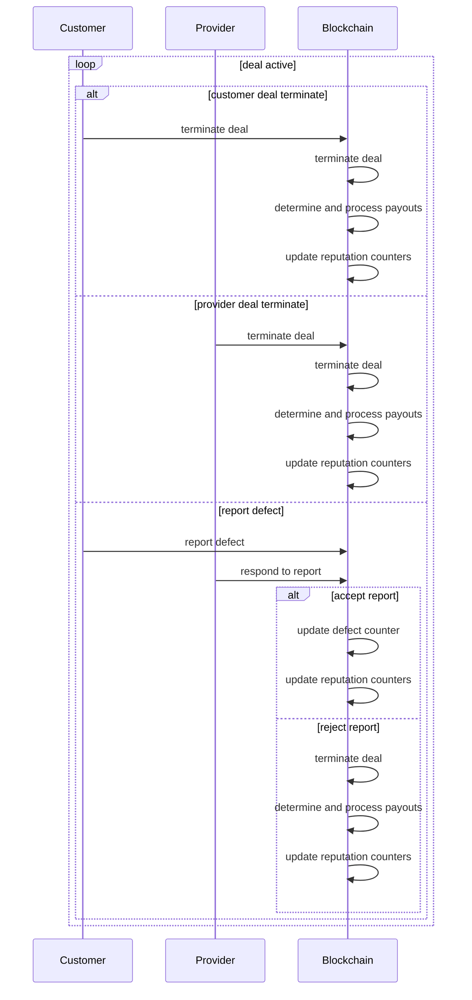

# Fluence dSLA Protocol

bb, 09/12/2024, WIP

## Introduction

Service Level Agreements (SLAs) are a cornerstone of cloud computing markets, serving as legally binding contracts that outline the delivery of computing resources based on predefined metrics. SLAs establish clear expectations between providers and customers, fostering a framework for accountability. A common feature of cloud service SLAs is that compensation for unmet SLA commitments is typically limited to the cost of the service during the affected period. For instance, if a cloud provider rents out a virtual machine (VM) for \$10 per month but fails to deliver the promised availability, the provider's maximum liability is limited to $10.

Customers often rely on monitoring tools and resolution processes provided, and even managed, by their cloud provider, with external intervention usually confined to arbitration. Thus, trust in the provider's brand, historical uptime performance, and the fair resolution of SLA breaches are crucial factors in defining the effectiveness of SLA agreements.

The Fluence decentralized compute platform represents a new paradigm in cloud(less) computing, facilitating the exchange of compute resources, such as Infrastructure as a Service (IaaS) and Platform as a Service (PaaS), in a trustless environment void of centralized control. Specifically, the Fluence protocol utilizes smart contracts to facilitate secure, automated transactions for provisioning and renting compute capacity from a network of Tier 4 data centers. This non-interactive approach ensures reliability and efficiency, allowing users to easily access high-quality computing resources.

Currently, the Fluence protocol lacks a quality of service framework for provisioned services, forcing customers to rely on latent attributes to select trustworthy and reliable providers. This approach is neither efficient nor desireable, especially considering the decentralized and diversity of compute providers. Therefore, implementing Service Level Agreements (SLAs) is essential as they not only improve compute customers' decision making but also allow providers to differentiate themselves in the marketplace.

Leaning on game theory and mechanism design, we propose a best-effort decentralized, trustless SLA framework resulting in a SLA protocol suitable for Fluence's trustless, non-interactive marketplace.

## SLA Fundamentals

We apply game theory to model SLAs to identify the prevailing strategic nature of service delivery and reporting. We further replay on mechanism design and incentive compatibility to create an environment most suitable to maintain a predictable set of strategies aligned with the core tenets of our desired system: providers are incentivized to adhere, or even exceed, their SLA commitments and both SLA providers and customers are incentivized to act honestly.

### The Basic SLA Structure

In a basic SLA framework, we have a service customer and a customer agreeing to some service contract governed by some quality of service (QoS). Each player has two strategies: act honestly, i.e., cooperate, or cheat, i.e., defect when it comes to the reporting and acceptance a reported defects. Due to the nature of the game, a player knows of the other player has cheated but neither player can provide a verifiable proof. Hence we are looking at an inspection game [] with the following (simplified) SLA game structure:

#### Players

* Customer ($C$)
* Service Provider ($SP$)

#### Actions

* Customer:
  * Report defect
  * Not report defect

* Provider:
  * Accept defect
  * Reject defect

#### Payoffs

* No Defect Reported, No Defect Exists:
  * $C$: -V
  * $SP$: V

* Defect Reported (by $CS), Defect Exists:
  * $C$: -V + $P_{SLA}$
  * $SP$: V - $P_{SLA}$

* Defect Reported (by $C$), No Defect Exists:
  * $C$: -V + $P_{SLA}$ (gain from falsely reporting)
  * $SP$: V - $P_{SLA}$ (still incurs defect penalty)

* No Defect Reported, Defect Exists:
  * $C$: -V (ignoring the cost of foregone service)
  * $SP$: V (ignoring the additional gain of not providing service)

where:

* $V$ is the value of the service contract, e.g., deal
* $P_{SLA}$ is the amount of the penalty incurred for SLA violations such that $P_{SLA} <= V$

##### Payoff Matrix

In this simplified SLA framework, if a provider meets the agreed-upon service levels, they earn a payoff *R*, e.g., \$10 per compute unit per month, and the customer pays $R$ resulting in a payoff tuple ($R$, $-R$) for the provider and customer, respectively. If the service falls short of expectations, an SLA penalty $P_{SLA}$ is subtracted from provider's revenue $R$ while the customer's payment is adjusted resulting in the new payoff tuple ($R-P_{SLA}$, $-R+P_{SLA}$).

Alas, in this naive setting both the provider and customer have incentives to cheat. While each player can detect cheating by the other, neither can provide objective proof. This dilemma is illustrated in Tables 1 and 2.

Table 1: Naive Payoff Matrix For SLA Game: Customer Cheats

| **Provider \ Customer** | **Truthful Reporting** | **False Reporting** |
|-------------------------|------------------------|---------------------|
| **High Availability**   | ($V$, $-V$)                | <font color="red">($V - P_{SLA}$, $-R + P_{SLA}$)</font> |
| **Low Availability**    | ($V - P_{SLA}$, $-V + P_{SLA}$)        | ($V -P_{SLA}$, $-V + P_{SLA}$)  (NA) |

Table 2: Naive Payoff Matrix For SLA Game: Provider Cheats

| **Customer \ Provider** | **Truthful Reporting** | **False Reporting** |
|-------------------------|------------------------|---------------------|
| **High Availability**   | ($V$, $-V$)                | ($V$, $-V$)  (NA)       |
| **Low Availability**    |  ($V - P_{SLA}$, $-V + P_{SLA}$)        |  <font color="red">($V - P_{SLA}$, $-V + P_{SLA}$)</font>                  |

Cheating is not objectively detectable in the (native) SLA game. For instance, a customer might ignore a ping request even when the VM is available or a provider could falsify availability records in a tamper-proof log for a VM that is actually unavailable. Consequently, only the participants are aware of the true state of the system, and there exists no definitively verifiable proof of the actual state.

SLAs are typically repeated games where reported defects, such as durations of unavailability, are aggregated over time and compared to threshold values to determine the applicability and magnitude of an SLA penalty $P_{SLA}$. As the game progresses, this can lead to endgame effects, where both the provider and the customer are increasingly incentivized to cheat to either avoid penalties or exploit (looming) defect thresholds.

Consequently, the (Nash) equilibrium often involves a mixed strategy that includes both cooperation and cheating and depends on the expectation of cheating and inspection frequency. While we ignored discount rates, gains/losses from cheating and the cumulative nature of defect aggregation against a specified threshold, these details have no material bearing on strategy selection and equilibrium.
Overall, the basic, naive SLA game framework that appears to work in interactive,centralized and trust-based systems to keep cheating in check appears unsuitable for decentralized, trustless environments like the Fluence DePIN compute marketplace. Hence, we need to transform the SLA game structure to be able to minimize, or entirely eliminate, cheating in a decentralized, trustless environment.

## SLA Protocol For Decentralized, Trustless Environments

Our main goal is to create and implement a SLA framework that drives incentive compatibility for both providers and customers, such that:

* Provider *SP* is incentivized to provide or exceed the Quality of Service (QoS) specified in the SLA
* Provider *SP* and customer *C* are incentivized to act truthfully at every step, aka repetition, of the game and especially at the end of the game, i.e., the end of the service contract


Since neither player can provide a verifiable proof that the other is cheating, a penalty framework needs to be introduced to credibly disincentivize dishonesty. Moreover, In a decentralized, trustless environment smart contracts play a critical role in manifesting and programmatically enforcing the rules of the game, which is a non-trivial departure from the centralized, trust-based model commonly offered in cloud service environments. While the existence of smart contracts does not magically resolve information asymmetry and cheating among parties, they certainly are helpful in transforming the game by providing (responsive) programmatic enforcement of rules, payments and penalties and allowing a fundamentally non-interactive framework.

In addition to a revised penalty framework, we also incorporate an exit condition available for both providers and customers currently available in the service contracts, aka deals, 

### Constructing The Penalty Model For Incentive Compatibility

Throughout the duration of a service contract governed by an SLA, both the provider and customer have multiple opportunities to exploit information asymmetries and engage in moral hazards. Therefore, it is essential to establish penalty models for each of these situations.

In addition to the potential for either the provider or customer to cheat regarding the reporting and acceptance of defects, both parties may exit a deal at any time before its due date without incurring penalties. This allows a provider to exit just before the cumulative defect count exceeds the penalty threshold, enabling them to retain (proportional) revenue before any SLA penalties apply.

We propose penalty models to address each scenario. Additionally, we suggest implementing reputation signals for the provider and customer that extend beyond the duration of a deal, serving as a persistent, global variable and an enduring indicator of past behavior.

#### Reporting Defection

The reporting defection scenario occurs when there is a disagreement between the provider and the customer regarding the level of service quality delivered. This conflict can arise from various factors, including deliberate dishonesty or insufficient monitoring of resources on either side. Regardless of the cause, this situation is undesirable and detrimental to the integrity and enforcement of the service contract and we propose an adjustment to the game that is programmatically enforceable by a (deal) smart contract, $SMD$.

##### Penalty Rule For Reported Defect Defection

At time $t$, $C$ reports a defect $d_t$ to $SMD$ and $SP$ either accepts or rejects the defect. If the provider accepts the defect, the cumulative defect counter $D_t$ increments by $d_t$ such that $D_t$ = $D_{t-1} + d_t$ and the game continues. If, on the other hand, $SP$ rejects $d_t$, the $SMD$ terminates the deal and imposes defection penalties on both the provider and the customer, without taking $d_t$ into consideration.

##### Actions And Payoffs

1. Deal Termination
    * The contract is terminated automatically by the $SMD$

2. No Defect Adjustment
    * The cumulative defect count remains unchanged, such that: 
\[D_t = D_{t-1} \]

3. Penalty Calculation
    * Provider revenue is 0
    * Customer cost is $max(t_e/t_d * V_d - P_{\text{SLA}}, 0)$

where:

* $V_d$ is the value, i.e., revenue to the provider and cost to the customer, of the deal for the agreed upon QoS 
* $P_{\text{SLA}} = 
\begin{cases} 
0 & \text{if } D_t \leq T \\
k \cdot (D_t - T) & \text{if } D_t > T \text{ , where k is the proportional multiplier} 
\end{cases}$

* $t_e \text{ is the time elapsed from start of deal } t - t_0$ and $t_d \text{ is the panned duration of the deal } t_{\text{end of deal}} - t_0$

##### Implications

The proposed penalty model is quite severe but falls short of requiring stakes and slashing, thereby making for a much more practical framework and implementation. Specifically, the model in conjunction with its programatic enforcement:

* Incentivizes Honest Reporting: By imposing penalties on both parties, it encourages transparency and accountability in defect reporting Keep in mind that both provider and customer have an expected value of engaging in a compute deal that at least equals but for all intends and purposes exceeds the deal value $V_d$. This is especially true for the provider as they are required to compensate their staker(s) from $V_d$. Hence, providers are unlikely to engage with customers deemed even ever so slightly dishonest. The same argument holds for customers. Some of the adverse effects from our draconian penalty model, such as a customer unwilling to report a defect if anticipating a cheating provider, are mitigated by providing an early exit option covered below.

* Ensures Fairness: The penalties are designed to mitigate the adverse effects of disputes, protecting both parties from undue losses.

* Promotes Efficient Resolution: The use of smart contracts allows for automatic enforcement of penalties, reducing the need for lengthy negotiations and facilitating quick resolutions.

#### Penalty Rule For Early Deal Termination

The decentralized, trustless Fluence marketplace inherently allow providers and customer to exit a deal any time prior to its expiration. In its unaltered state, this allows for gaming SLA agreements. For example, a provider might exit the deal when the defect count $D_t$ approaches the SLA penalty threshold $T$ in order to maximize revenue while failing to deliver the agreed upon QoS. Hence, we need a penalty model covering early deal termination.

##### Actions And Payoffs

1. Deal Termination By Customer

* The deal is terminated by the customer before the end of the service agreement and customer cost is the proportional value of the deal, $V_D$ minus any SLA penlaty credits, if applicable such that:
\[ \text{Customer cost is } \max(-(t_e/t_d*V_d) + P_SLA, 0) \]

2. Deal Termination By Provider

The deal is terminated by the provider before the end of the service agreement and customer cost is the proportional value of the deal and an SLA penalty even if the service quality threshold $T$ has not been exceeded such that:

* Provider revenue = $(t_e/t_d)*V - P_{\text{adjSLA}}$

where

* $P_{\text{adjSLA}} = (D_t /T)*P_\text{SLA}$

#### Reputation Rule For Reported Defect Defection

To further enhance deal participants' accountability, we implement a reputation system that complements monetary penalties for non-incentive compatible behavior. This system provides lasting reputation signals for providers and customers.

For each deal participant, we maintain the following counters:

1. Defection Counter $𝐷𝐶$

* This tuple reflects both merit and demerit. It records:
  * Positive Credit: Awarded for cooperative handling of defect reports
  * Negative Credit: Assigned for non-cooperative handling of defect reports

2. Early Exit Counter $EC$

* This counter increments by one for each early termination of a deal and tracks the total number of deals contracted

> [!Note]
> The $EC$ counter should be maintained even for deals not governed by an SLA.

Both counters are maintained separately for each participant, i.e. provider and customer, and are cumulative across all deals they have participated in. This approach provides the data necessary to assess comprehensive assessment of reliability and encourages better cooperation in future engagements.

##### Actions And Payoffs

1. Defection counter $DC_\text{player-i} = (C, D) \text{ such that}$

* $C = \text{ Total credits for cooperation (merit)}$
* $D = \text{ Total debits for defection (demerit)}$
* $N = C + D = \text{ Total number of opportunities to cooperate (game count)}$ 

> [!Note]
> If more detailed data is required, it is of course possible to capture a more fine-grained state representation, e.g, $[(C, D)_\text{deal-id}, \text{ ...}]$. However, the cost of on-chain (or DA) storage may impact the final resolution approach.

2. Early exit counter $EC = (E, N) \text { such that:}$

* $E = \text{ total early termination count}$
* $N = \text{ number of deal contracts}$

Both counters, individually and combined, provide reputation signals beyond current deals and drive further incentive compatibility by both providers and customers. Due to the possibility of early deal termination, a QoS counter *per se* seems too incomplete to provide a reliable signal (although that may be debatable).

### Summary

We focused on incentive compatibility and mechanism design to restructure a Service Level Agreement (SLA) framework commonly used in centralized, trusted cloud service environments, adapting it for decentralized, trustless settings. We introduced penalty models for defect reporting and early deal termination, further enhancing them with reputation signals. We believe this approach will achieve high incentive compatibility among providers and customers of the decentralized, trustless Fluence cloudless compute marketplace. This revised, decentralized SLA (dSLA) framework, is expected to encourage cooperation, eliminate cheating, and motivate providers to deliver the promised Quality of Service (QoS).

## Implementing The dSLA Protocol

To implement the dSLA protocol in an Arbitrum rollup environment, it is essential to acknowledge that the block timestamp is reasonably reliable, despite the absence of a fixed block time. In this context, the sequencer's timestamp serves as the reference clock. Furthermore, we assume that Stylus operates as a fully functional, EVM-integrated WASM32-WASI runtime [], enabling compatibility with ed25519 and potentially BLS curves. And finally, we assume that the Fluence L2 gas costs are sufficiently negligible to not impeded dSLA reporting and processing requirements.

Our primary concerns in implementing the dSLA protocol include the structure of the defect report, the defect reporting and reviewing processes and ensuing dSLA penalty model adjustments. Moreover, we assume that the initial dSLA implementation is limited to uptime and expressed in the "nines" tradition [].

### dSLA Lifecycle  

The dSLA protocol outlined above is mapped into a sequence of onchain transactions in Figure 1.

Figure 1: Stylized SLA-Based Deal Flow



not enough ...

### Quality Of Service Specification

A provider's Quality of Service, e.g., the uptime of a VM, is typically quantified in terms of "nines" of expected uptime []. For instance, five nines, i.e., 99.999%, indicates a maximum allowable downtime of the covered service of at most 26 seconds per month [].

In the context of SLAs, various uptime ranges and corresponding penalty coefficients are established. For example, a provider may commit to an uptime of 99.0% (two nines). Should the actual uptime fall  below this threshold but remain above, say, 98.5% uptime, the penalty may be 10% of the contract, aka deal, value. See Table 3 for a multi range example.

Table 3: Illustrative Downtime Penalty Ranges

| Uptime (%)          | < 95% | < 98.5% | < 99% |
|---------------------|----- |-------|-------|
| Downtime (hours)    | 22.24| 10.87 | 7.24  |
| Penalty coefficient | 1.0  | 0.30  | 0.1   |
| Penalty<br>Deal Value USD 10.00 | 10.0 | 3.0| 1.0|  

The above approach maps in into a Rust interface as outlined in Figure 2:

Figure 2: Stylized Provider QoS Interface

```Rust

struct QoSCommitment {
    uptime: String, // nines
    downtime_hours: f64,
    penalty_coefficient: f64,
}

struct SLAHandler {
  penalty_ranges: Vec<QoSCommitment>,
}

impl SLAHandler {
  fn new(qos_ranges: Vec<QoSCommitment>) -> Self {
      Self {
          penalty_ranges: qos_ranges
      }
  }

  fn calculate_penalty(&self, reported_downtime: f64, deal_value: f64) -> f64 {
        self.penalty_ranges
            .iter()
            .find(|range| reported_downtime > range.downtime_hours) // Find the first applicable range
            .map(|range| range.penalty_coefficient.min(1.0) * deal_value) // Calculate penalty, capping coefficient at 1.0
            .unwrap_or(0.0) // No penalty if uptime is above all ranges
    }
}
```

### Creating Defect Reports

From a customers perspective, the defect reporting process is quite critical. 


#### Cryptographic Commitments

In order to be able to provide a scalable non-interactive, trustless SLA reporting and enforcement solution, defects $d_t$ are periodically reported by the customer $C$ for the deal to $SMD$.


In order to prevent leaking of C's reported timestamp for reuse by other customers of SP, C submits a Pedersen Vector Commitment [],[] for the timestamp of the observed defect and a nonce of the request.

Instead of a nonce, C submits a duration of the observed defect with a maximum duration of k seconds such that D_t = (t_0, t_1) where the maximum ... so for three consecutive pings at k second intervals: 
(t_0, t_1) where t_1 - t_0 =5
(t_1, t_2), where t2 - t_1 = 5
(t_2, t_3) where t_3 - t_2 = 2, for example

it is critical that note that for EVM-based blockchains, the final inclusion of transactions for a particular address, such as the C address, respects the nonce order. As long as the commitments, or raw timestamps are nonce'd properly and the blocks are finalized and any mis-ordering of commitments is an error attributable to C.


### Submitting And Responding To Defect Reports

### 

## References

[] Inspection game, http://www.maths.lse.ac.uk/personal/stengel/TEXTE/insp.pdf

[] Abrbitrum time, https://docs.arbitrum.io/build-decentralized-apps/arbitrum-vs-ethereum/block-numbers-and-time
[] Arbitrum Stylus, https://arbitrum.io/stylus
[] Uptime calculator, https://uptime.is/


